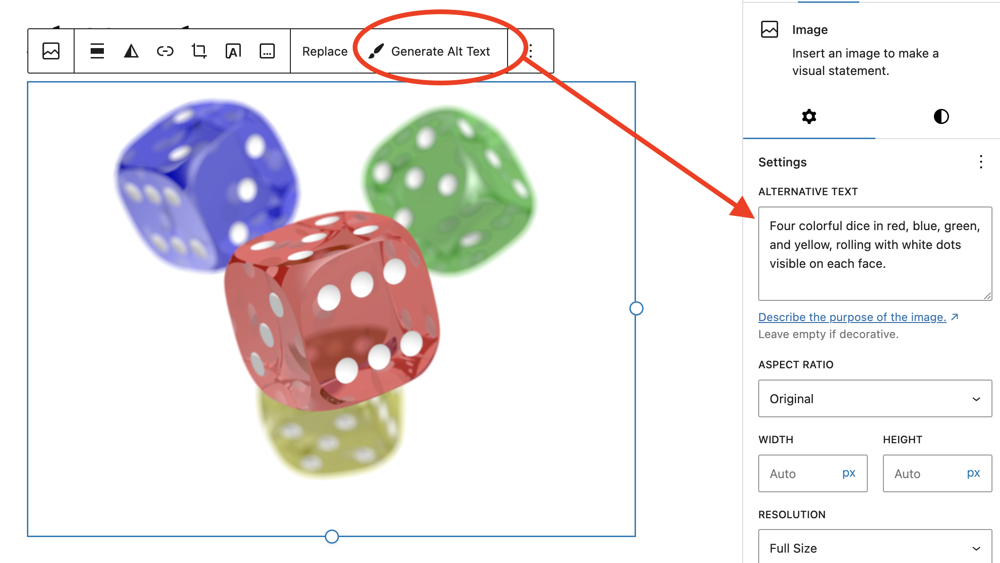
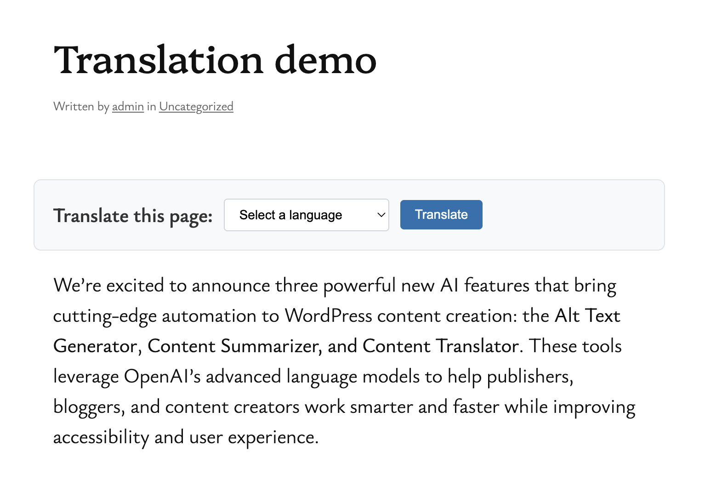

# JP WP AI
## Description
An AI experimentation plugin for WordPress.

**WARNING: This is not intended for use in production.**

The plugin integrates AI capabilities into your WordPress site using the Abilities API.

## Features

### Alt Text Generator
Automatically generates descriptive alt text for images using AI vision capabilities:
- One-click alt text generation in the Media Library
- Integration with the Block Editor for inline generation
- Uses OpenAI's vision API for accurate image descriptions
- Improves accessibility and SEO

### Content Summarizer
AI-powered content summarization for posts and pages:
- Generate concise summaries of long-form content
- Useful for excerpts, meta descriptions, and social media
- Customizable summary length and style

### Content Translator
Translate post content into multiple languages with AI:
- Front-end language selector block for visitor translations
- Supports 10 common languages (Spanish, French, German, Japanese, Chinese, Portuguese, Italian, Russian, Arabic, Hindi)
- Auto-detects visitor's browser language
- Smart caching for fast subsequent translations
- Seamless content switching without page reload

## Requirements

- WordPress 6.9 or higher
- PHP 7.4 or higher
- [WordPress AI Plugin](https://github.com/WordPress/ai)
- OpenAI API key

## Configuration

After activation, navigate to **Settings > JP WP AI** to configure your OpenAI API key.

## Usage

### Generating Alt Text

**In the Block Editor:**
1. Select an image block
2. Use the AI alt text generation option in the block toolbar
3. Review and save the generated alt text

### Summarizing Content

1. Create or edit a post/page
2. Use the content summarizer feature in the editor
3. Customize the summary length if needed
4. Insert the summary into your content

### Translating Content

**For Publishers:**
1. Create or edit a post/page in the Block Editor
2. Add the "Content Translator" block where you want the language selector to appear
3. Publish the page

**For Visitors:**
1. Navigate to a page with the Content Translator block
2. Select your preferred language from the dropdown
3. Click "Translate" to view the content in that language
4. Click "Show Original" to restore the original content

## License

GPL-2.0-or-later

## Credits

Created by John Parris with AI assistance.
